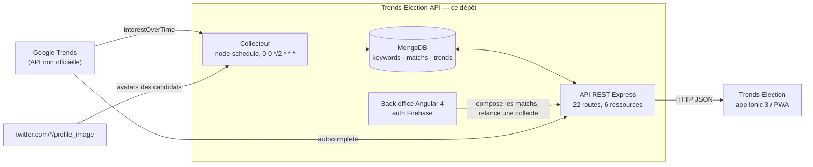

# Trends Election — API, collecteur et back-office

Le back de **Trends Election** : il collecte l'intérêt de recherche Google pour
les candidats d'une élection, l'archive en séries temporelles et l'expose à
l'application mobile [tonylucas/Trends-Election](https://github.com/tonylucas/Trends-Election).

> API REST Node.js/Express adossée à MongoDB, doublée d'un collecteur planifié
> qui interroge Google Trends toutes les deux heures sur deux fenêtres
> glissantes (24 h et 7 jours), et d'un back-office Angular 4 pour composer les
> « matchs » d'une élection.
>
> Projet de fin de **Master Développement Web** (ECV Digital, 2017), écrit de
> zéro autour d'une question : *les recherches Google prédisent-elles le
> résultat d'une présidentielle ?* Construit et déployé pendant la campagne
> française de 2017, contre une API Google Trends non officielle et non
> documentée.

## Le flux



Un **keyword** est un candidat (identifié par son *MID* Google, pas par une
chaîne de caractères, pour éviter les homonymes) ; un **match** est une
élection, soit un ensemble de keywords, un pays et une date de scrutin ; une
**trend** est la série de valeurs collectée pour un match sur une fenêtre
donnée.

## Ce que le projet a demandé

| Compétence | Où le lire |
|---|---|
| **API REST Node.js/Express** : 22 routes sur 6 ressources, découpage `controllers` / `models`, routage monté en un point unique, CORS restreint à une liste d'origines | [`server/controllers/`](server/controllers/), [`server/app.js`](server/app.js) |
| **Collecte planifiée** : job `node-schedule` toutes les 2 h, quatre passes concurrentes agrégées par `Promise.all`, nouvelles séries écrites **avant** purge des anciennes — l'app ne lit jamais une base vide, et chaque échec de fetch est tracé dans un journal plutôt que de faire tomber la passe | [`server/models/cron.js`](server/models/cron.js), [`server/cron.js`](server/cron.js) |
| **Intégration d'une API tierce non documentée** : fenêtres glissantes Google Trends (`now 1-d`, `now 7-d`) recalculées à partir de la date de scrutin avec moment, et dépollution du préfixe anti-JSONP `)]}',` que Google préfixe à ses réponses d'autocomplétion | [`server/models/google-trends.js`](server/models/google-trends.js), [`server/controllers/google-autocomplete.js`](server/controllers/google-autocomplete.js) |
| **Modélisation de séries temporelles** : schémas Mongoose `keyword` / `match` / `trend`, les séries reliées à leur parent par `parentId` + `period`, ce qui permet plusieurs fenêtres par élection | [`server/models/`](server/models/) |
| **SPA Angular 4 + RxJS** : back-office de composition des matchs, autocomplétion asynchrone branchée sur l'API Google via le serveur, redirection sur l'état d'authentification Firebase | [`src/pages/`](src/pages/), [`src/app/app.module.ts`](src/app/app.module.ts) |
| **Mise en production** : deux process PM2 (API + bundle statique) sur un VPS, endpoints et identifiants sortis du code vers l'environnement | [`process.json`](process.json), [`src/environments/`](src/environments/) |

**Périmètre, vérifiable dans le dépôt** — 14 modules Node et 18 fichiers
TypeScript ; 6 ressources REST pour 22 routes ; 3 collections MongoDB ; 2
fenêtres temporelles collectées par élection ; 5 candidats affichables par match
(la limite vient de la palette côté app) ; valeurs Google Trends normalisées
0–100.

## Stack

Node.js · Express 4 · MongoDB / Mongoose 4 · node-schedule · `google-trends-api` ·
Angular 4 · RxJS 5 · TypeScript 2 · Firebase Auth · PM2

## Faire tourner

Les identifiants de déploiement ont été remplacés par des variables
d'environnement et des placeholders (`<api-host>`, `<firebase-api-key>`) avant
le passage en public. Le projet Firebase d'origine est désactivé : il faut le
vôtre pour que le back-office authentifie.

```sh
# API + collecteur
cd server && npm install
MONGO_URL=mongodb://localhost/api CORS_ORIGINS=http://localhost:4200 npm start   # port 3000

# Back-office
npm install && npm start   # port 4200
```

Variables lues par le serveur : `MONGO_URL`, `CORS_ORIGINS` (liste séparée par
des virgules), `PORT`. Configuration Firebase et endpoint de l'API :
[`src/environments/environment.ts`](src/environments/environment.ts).

## Limites, assumées

Dépôt **archivé en l'état de mai 2017**, gardé comme témoin de ce que je savais
faire à la sortie du master — pas maintenu, pas rejoué depuis.

- Pas de suite de tests : seul le squelette Karma / Protractor généré par
  l'Angular CLI est présent, sans spec écrite.
- Le code est en callbacks imbriqués là où `async/await` était déjà
  disponible ; `server/controllers/matchs.js` compte les réponses à la main avec
  un `setTimeout`, ce qu'un `Promise.all` ferait proprement.
- L'onglet « par région » de l'app est resté une carte vide : la collecte
  `interestByRegion` n'a jamais été branchée.
- La collecte des tendances par *keyword* isolé est commentée dans
  [`server/models/cron.js`](server/models/cron.js) : seules les séries par match
  sont réellement alimentées.
- La relance manuelle depuis le back-office lit `keyword.name` et `match.name`
  là où les schémas Mongoose exposent `title`
  ([`src/providers/trends.ts`](src/providers/trends.ts)) : elle est cassée, seul
  le collecteur planifié alimente vraiment la base.
- Le code applicatif est en anglais, la documentation et les logs en français.

## Dépôt lié

[**tonylucas/Trends-Election**](https://github.com/tonylucas/Trends-Election) —
l'application mobile Ionic 3 qui consomme cette API.
